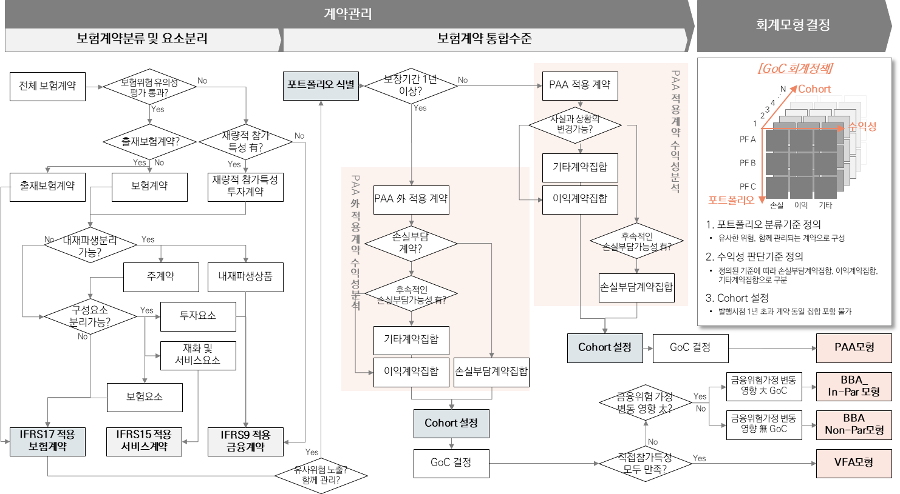

# 2.계약관리

IFRS 17 프로세스 중 첫 번째 프로세스인 계약관리는 아래의 그림으로 나타낼 수 있으며, 다시 보험계약분류, 구성요소 분리, 보험계약 통합수준 정의, 회계모형 결정 프로세스로 세분화됨


* [_**2.1 보험계약분류**_](broken-reference) \
  : 보험계약의 정의를 충족하는 보험계약 선정&#x20;
* [_**2.2 구성요소분리**_](broken-reference)\
  : 보험계약에 포함되어 있는 하나 이상의 구성요소 (내재파생상품, 투자요소, 서비스요소, 보험요소)의 분리&#x20;
* [_**2.3 보험계약 통합수준**_](broken-reference)\
  &#x20;: 포트폴리오 식별, 수익성 판단 및 Cohort 설정을 통한 보험계약집합 결정&#x20;
* [_**2.4 회계모형 결정**_](broken-reference) \
  : 보험계약집합의 일반모형, 보험료배분접근법, 변동수수료접근법 중 회계모형 선택


<figure><figcaption>
사전 프로세스
</figcaption></figure>
