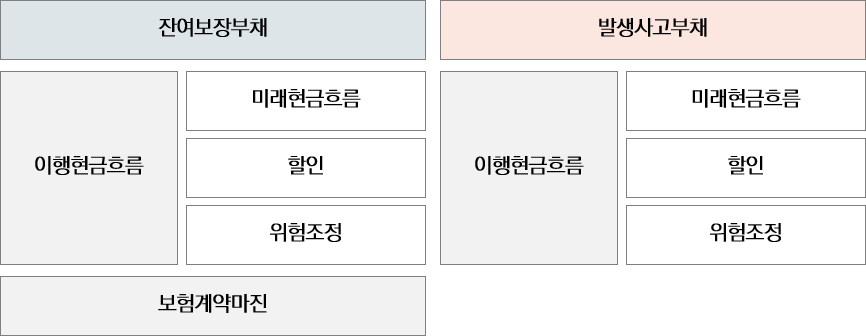

# 4.1 이행현금흐름 후속측정

보고기간 말 후속적으로 측정된 보험계약집합은 잔여보장부채, 발생사고부채로 구성됨. 잔여보장부채는 다시 이행현금흐름과 보험계약마진으로 구성되고, 발생사고부채는 이행현금흐름으로 구성됨. 후속적으로 측정된 회계항목의 변동분에 대하여 기준서는 회계처리 기준을 규정하고 있으며, 회계처리 원칙에 따라 수익과 비용으로 구분하여 인식해야 함.&#x20;

<figure><figcaption>
보험계약부채의 구성
</figcaption></figure>

보험계약마진과 관련된 사항은[ 4.2 보험계약마진 후속측정](broken-reference)에서 기술함.  &#x20;
