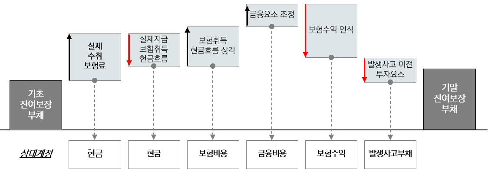
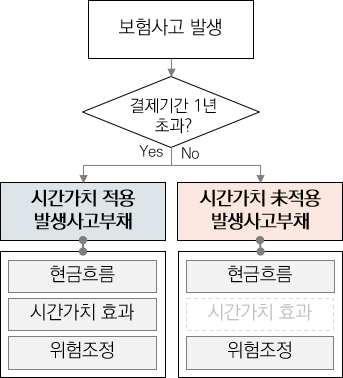
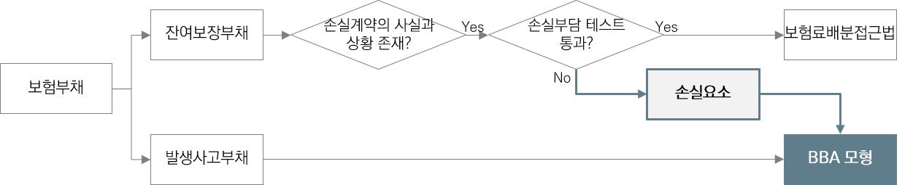
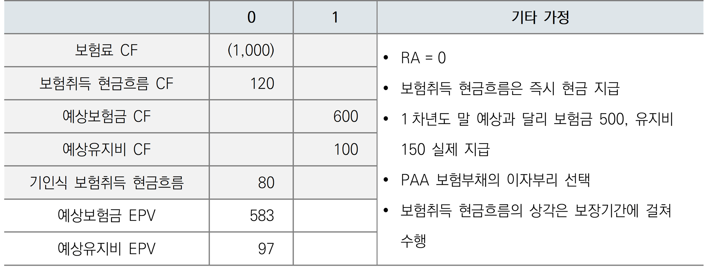

# 5.3.1 기준서 주요내용

## 잔여보장부채&#x20;

각 후속 보고기간 말 잔여보장부채는 보고기간 초 장부금액에서 문단 55(2)에서 규정한 항목을 차·가감하여 산정함.&#x20;

<figure><figcaption>
보험료배분접근법 잔여보장부채 후속측정 
</figcaption></figure>

#### 1) 해당기간에 수취한 보험료&#x20;

* 보험료 유입액만큼 잔여보장부채를 증가시키며 예상보험료가 아닌 실제 수취한 보험료&#x20;

#### 2) 실제 지급 보험취득 현금흐름&#x20;

* 즉시 비용처리 하지 않은 경우, 최초인식시점에 실제 지급한 보험취득 현금흐름은 잔여보장부채에서 차감함.
* 문단 59(1)에서는 최초인식시점에 집합 내 각 계약의 보장기간이 1년을 초과하지 않는다면 보험취득 현금흐름을 발생시 비용으로 인식할 수 있도록 규정함.&#x20;
* 문단 59(1)에 따라 실제 지급액을 비용으로 인식하기로 선택한 경우는 해당 항목을 고려하지 않음&#x20;

#### 3) 보고기간에 비용으로 인식한 보험취득 현금흐름의 상각과 관련된 금액&#x20;

* 즉시 비용처리 하지 않은 경우, 보험취득 현금흐름은 후속적으로 상각하여 보험비용과 부채를 증가시킴.&#x20;
* 다만, 문단 59(1)에 따라 실제 지급액을 비용으로 인식하기로 선택한 경우는 해당 항목을 고려하지 않음.&#x20;

#### 4) 금융요소 조정분(문단 56)

* 집합 내 보험계약이 유의적인 금융요소를 가지고 있다면 최초 인식시점에 산정된 할인율을 사용하여 화폐의 시간가치와 금융위험의 효과를 반영하도록 잔여보장부채의 장부금액을 조정함.&#x20;
* 다만, 최초인식시점에 서비스의 각 부분을 제공하는 시점과 관련 보험료 납입기일 사이의 기간이 1년 이하일 것으로 예상한다면 화폐의 시간가치와 금융위험의 효과를 반영하기 위해 잔여보장부채의 장부금액을 조정할 필요 없음.
  * IASB는 보험료 납입기일과 보장제공 사이의 기간이 1년 이하일 때, 그 집합은 유의적인 금융요소를 갖지 않는 것으로 간주하였으며, 금융요소의 조정할 필요가 없다는 의견을 제시함(문단 BC291(1)).&#x20;
  * 이는 유의적인 금융요소를 가지는 경우, 잔여보장부채에 이자를 부리 할 수 있는 것으로 해석 가능함.&#x20;

#### 5) 해당 기간에 제공한 서비스에 대하여 보험수익으로 인식한 금액(문단 B126)

* 해당기간의 보험수익은 그 기간에 배분된 예상 보험료 수취액이며, 다음에 따라 예상 보험료 수취액을 매 보험계약서비스 기간에 배분함.&#x20;
  * 시간의 경과 기준&#x20;
  * 보장기간에 위험이 해제될 것으로 기대되는 양상이 시간의 경과와 유의적으로 다른 경우에는 보험서비스비용이 발생될 것으로 기대되는 시기 기준&#x20;
* 예상 보험료 수취액은 투자요소를 제외하고, 화폐의 시간가치와 금융위험의 효과를 반영하기 위해 조정함.&#x20;
* 사실과 상황이 변했다면, 필요한 경우 배부기준의 변경이 가능함&#x20;

#### 6) 지급되거나 발생사고부채로 이전된 투자요소

* 실제로 발생한 금액만큼 잔여보장부채를 감소시키고 발생사고부채를 증가&#x20;

## 발생사고부채&#x20;

보험료배분접근법 하에서 발생사고부채는 일부 예외사항을 제외하고 일반모형의 발생사고부채와 동일한 방식으로 측정되므로 보고기간 말 시점에 집합에 배분된 과거 서비스와 관련된 이행현금흐름(미래 현금흐름의 현재가치 추정치, 위험조정)으로 측정해야 함.&#x20;

다만, IFRS 17은 발생사고부채의 측정에 대한 간소화도 허용하고 있음. 문단 59(2)에서는 보험금과 투자요소가 발생한 날로부터 1년 이내에 지급되거나 수령될 것으로 예상되는 경우에는 미래 현금흐름을 화폐의 시간가치와 금융위험 효과에 대해 조정할 필요 없음을 규정하고 있음. &#x20;

<figure><figcaption>
보험료배분접근법 발생사고부채
</figcaption></figure>

#### 1) 보험금 및 투자요소

* 보험금은 발생시점에 추정한 금액만큼 보험비용과 발생사고부채에 증가 &#x20;
* 투자요소는 실제로 발생한 금액만큼 잔여보장부채를 감소시키고 발생사고부채를 증가시키며, 투자요소의 경험조정은 별도로 인식하지 않음 .

#### 2) 이행현금흐름

* 일반모형과 동일한 방식으로 측정하며, 미래현금흐름의 현재가치 추정치와 비금융위험의 위험조정으로 구성
  .
* 일반모형과 같이 문단 81에 따라 비금융위험의 위험조정의 변동분을 보험서비스결과와 보험금융수익(비용)으로 세분화할 필요 없음.&#x20;

#### 3) 시간가치와 금융위험 효과조정(문단 B133, BC295)

* 문단 88(2)를 적용하여 보험금융수익(비용)을 구분하는 것을 선택 가능&#x20;
* 보험금융수익(비용)을 당기손익과 기타포괄손익으로 구분 인식하는 경우에는 문단 B72(5)(다)에 따라 보험금 발생일에 결정된 기초항목의 성과에도 연동되지 않는 명목 할인율을 적용함.
  * IASB는 간소화를 위해 개발된 보험료배분접근법이 기업에게 높은 비용과 운영상 복잡성을 유발하여 부담을 주지 않아야 된다고 결론을 내렸으므로 보험계약집합을 최초로 인식하였을 때가 아니라 발생사고부채를 최초로 인식하였을 때 적용되는 이자율을 사용할 것을 제시함.

## 손실부담계약&#x20;

보험료배분접근법에서는 보장기간 중 어느 때라도 손실계약임을 나타내는 사실과 상황이 나타난다면 일반모형과 보험료배분접근법의 잔여보장부채를 비교하여 손실요소를 인식해야 함(문단 57). 이는 보험료배분접근법의 적용을 간소하게 유지하기 위한 IASB의 결정사항으로 기업은 사실 및 상황이 손실을 부담하게 되었다고 나타내는 경우에만 보험계약집합이 손실을 부담하는지 평가해야 함.&#x20;

보험료배분접근법을 적용하여 측정하는 보험계약집합이 손실계약이 된다면 손실은 문단 58에 따라 즉시 당기손익으로 인식하고 잔여보장부채를 증가시키는 회계처리를 수행함. &#x20;

<figure><figcaption>
손실요소 인식 프로세스
</figcaption></figure>

#### 1) 사실과 상황 판단&#x20;

* 손실계약임을 나타내는 사실과 상황의 존재여부를 판단하며, 사실과 상황의 존재가 없는 경우 손실요소의 측정이 불필요함.
* 단, 기준서에서는 사실과 상황의 판단을 위한 구체적인 기준을 제시하지 않음. &#x20;

#### 2) 손실요소 측정(손실부담 Test)

* 일반모형을 사용한 집합의 잔여보장과 관련된 이행현금흐름과 보험료배분접근법을 사용한 잔여보장부채의 차이로 측정&#x20;
* 보험료배분접근법을 사용한 발생사고부채 측정 시 문단 59(2)에 따라 화폐의 시간가치와 금융위험의 효과를 조정하지 않는 경우, 일반모형을 사용한 집합의 잔여보장과 관련된 이행현금흐름은 측정 시에도 화폐의 시간가치와 금융위험의 효과에 대한 조정분을 포함시키지 않음. &#x20;

#### 3) 손실요소 인식&#x20;

* 보험료배분접근법을 적용한 잔여보장부채 금액보다 일반모형을 적용한 잔여보장부채의 금액이 큰 경우, 차이만큼을 손실로 인식하고 잔여보장부채를 증가시킴&#x20;
* 손실요소 인식 시, 일반모형을 적용하여 이행현금흐름을 측정하고, 보장기간이 1년 이하 이더라도 시간가치 효과에 대한 인식이 필요함(문단 56 적용불가).   &#x20;

이상의 보험료배분접근법과 관련한 회계기준에 대하여 일반모형의  기준과의 차이를 정리하면 다음과 같음

<figure><figcaption>
일반모형과 보험료배분접근법 비교
</figcaption></figure>

> **보험료배분접근법 적용사례**
>
> 최초 인식 직후에 1,000원의 보험료 및 120원의 보험취득 현금흐름이 발생하며, 최초인식 이전 보험취득 현금흐름이 발생하여 자산으로 기인식한 보험취득 현금흐름 80이 있음. 보장기간은 1년이며, 1차년도 말 보험금 600, 유지비 100이 발생할 것으로 예상함. 무위험 수익률은 3%를 가정함.   &#x20;

<figure><figcaption></figcaption></figure>

> **1) 최초인식시점**&#x20;
>
> * 일반모형
>   * CSM = 유입 EPV 1,000 – 유출 EPV 800 –기인식 제거자산 80 – RA 0 = 120
>   * 구성요소 \
>     &#x20;&#x20;
>   *   회계처리&#x20;
>
>       * 예상보험료                           
>       * 보험취득 현금흐름 발생     
>       * 기인식 자산 제거                 
>       * 예상 보험금                          
>       * 예상유지비                           
>       * 보험료 수취                          
>       * 보험취득 현금흐름 지급     
>
>
>   *   보험료배분접근법
>
>       * 구성요소
>
>       &#x20;\
>
>
>       * 회계처리&#x20;
>         * 수취보험료                            
>         * 보험취득 현금흐름 지급      
>         * 기인식 자산 제거                  
>
> **2) 1차년도 결산**
>
> * 일반모형
>   * 구성요소\
>     &#x20;&#x20;
>   *   회계처리&#x20;
>
>       * 시간가치감소\_보험금          &#x20;
>       * 시간가치감소\_유지비          &#x20;
>       * 보험금 Release                     &#x20;
>       * 유지비 Release                     &#x20;
>       * CSM 이자부리                       &#x20;
>       * CSM 상각                               &#x20;
>       * 보험취득 현금흐름 상각      &#x20;
>
>
> * 보험료배분접근법
>   * 구성요소\
>     &#x20;&#x20;
>   * 회계처리&#x20;
>     * 시간가치감소                        &#x20;
>     * 보험금 지급                           &#x20;
>     * 유지비 지급                           &#x20;
>     * 보험취득 현금흐름 상각      &#x20;
>     * 보험수익 인식                       &#x20;
>
> 3\) 손익계산서&#x20;

<figure><figcaption></figcaption></figure>
