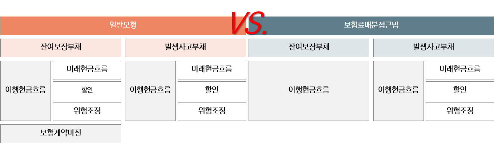
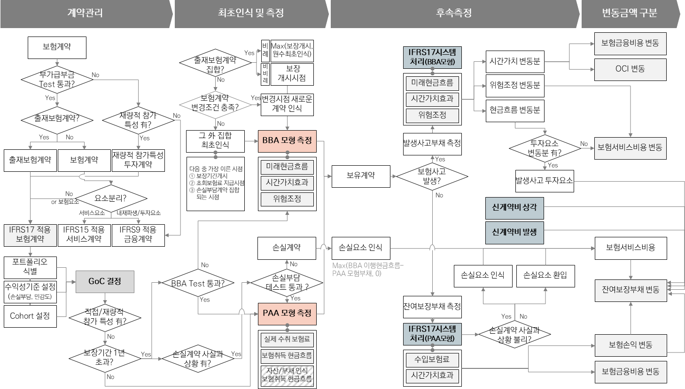

# 5. 보험료 배분 접근법

보험료배분접근법(Premium allocation approach; PAA)은 적격한 보험계약집합의 잔여보장부채를 측정하기 위한 단순한 방법으로 이 방법을 적용하더라도 발생사고부채는 일반모형을 사용하여 측정해야 함.&#x20;

<figure><figcaption>
일반모형과 보험료배분접근법의 보험계약부채 구성 비교
</figcaption></figure>

보험료배분접근법을 적용한 보험계약 측정은 프로세스는 다음의 그림과 같음.&#x20;


* **계약관리**\
  : 보험료배분접근법 적용조건 판단 및 적용 보험계약의 통합수준 정의 &#x20;
* **최초측정**\
  : 기준서에서 제시한 항목을 이용한 최초인식시점의 부채 장부금액 측정
* **후속측정 및 변동금액 구분**\
  : 기준서에서 제시한 차·가감 항목을 이용한 기말 잔여보장부채 측정 및 일반모형을 적용한 발생사고부채 측정 등의 후속측정과 그에 따른 변동금액 구분 인식&#x20;


<figure><figcaption>
보혐료배분접근법 프로세스
</figcaption></figure>
